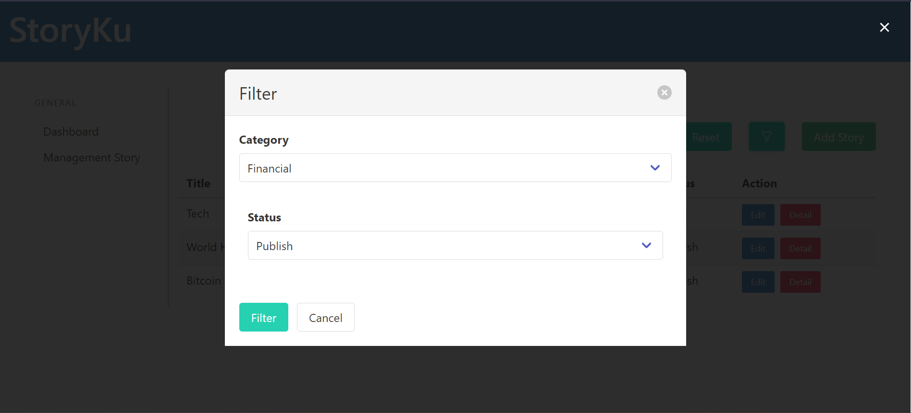
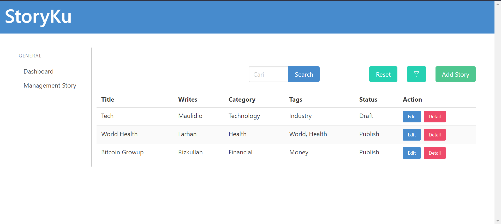
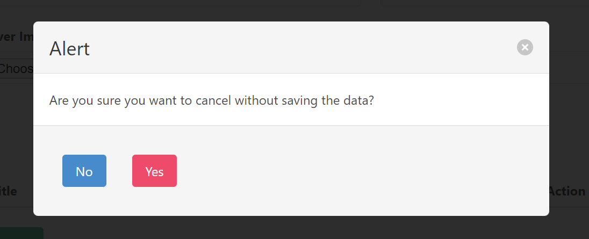
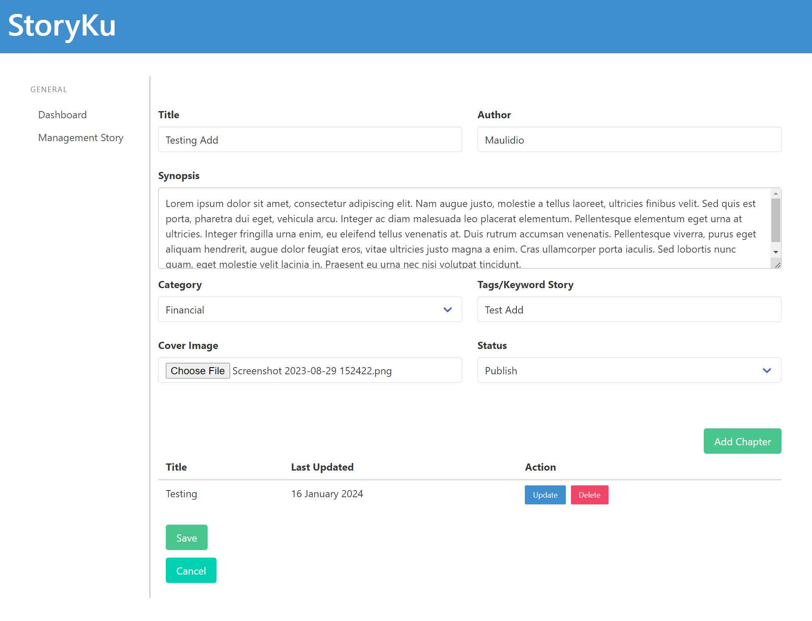
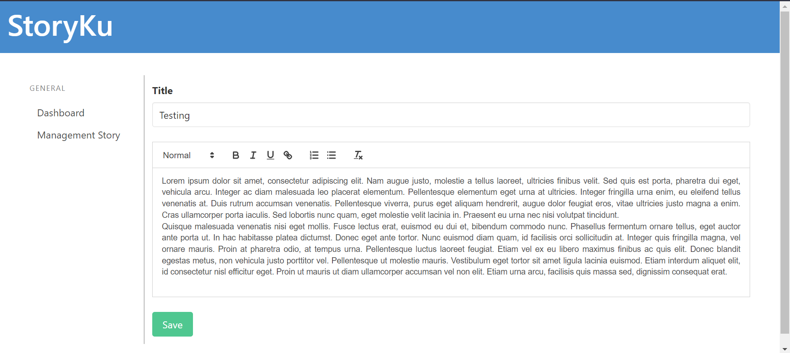

# BIGIO Fullstack Dev - Take Home Challenge StoryKu Website Application

## Introduction

The StoryKu website application is developed using ReactJS for the FrontEnd and ExpressJS for the Backend. This application implements CRU (Create, Read, and Update) operations for the Story data and CRUD (Create, Read, Update, and Delete) operations for the chapters within each Story.

The technology stack chosen for this project reflects a focus on modern, efficient, and scalable solutions. ReactJS, a widely-used JavaScript library for building user interfaces, ensures a responsive and dynamic FrontEnd. ExpressJS, a fast and minimalist web framework for Node.js, provides a robust and scalable Backend.


## Table of Contents

- [Introduction](#introduction)
- [Authors](#authors)
- [Features](#features)
- [Libraries](#libraries)
- [Project Structure](#project-structure)
- [List Of Challenge Requirements](#list-of-challenge-requirements)
- [Website URL](#youtube-url)
- [Contact](#contact)
## Authors

- [@DioGitH](https://www.github.com/DioGitH)


## Features

- Story List
    - Search by title or author
    - Filter popup modal  
    - Reset filter
    - Table shown Story list with several columns
- Add Story
    - Input general information
    - Chapter List
        - Add chapter
        - List chapter table
- Story Detail
- Edit Story


## Libraries

- ReactJS
    - axios
    - bulma
    - date-fns
    - react-bulma-components
    - react-quill
    - react-router-dom
    - web-vitals
- ExpressJS
    - cors
    - mysql2
    - sequelize


## Project Structure

```bash
Bigio/
|-- backend/
|   |-- node_modules/
|   |-- config/
|   |   |-- Database.js
|   |-- controllers/
|   |   |-- ChapterController.js
|   |   |-- StoryController.js
|   |-- models/
|   |   |-- ChapterModel.js
|   |   |-- StoryModel.js
|   |-- routes/
|   |   |-- ChapterRoute.js
|   |   |-- StoryRoute.js
|   |-- index.js
|   |-- package-lock.json
|   |-- package.json
|-- frontend/
|   |-- node_modules/
|   |-- public/
|   |-- src/
|   |   |-- components/
|   |   |   |-- AddChapterPage.js
|   |   |   |-- AddStoryPage.js
|   |   |   |-- DashboardPage.js
|   |   |   |-- DetailChapterPage.js
|   |   |   |-- DetailStoryPage.js
|   |   |   |-- Header.js
|   |   |   |-- ModalCancel.js
|   |   |   |-- ModalFilter.js
|   |   |   |-- SideNav.js
|   |   |   |-- StoryPage.js
|   |   |   |-- UpdateChapterPage.js
|   |   |   |-- UpdateStoryPage.js
|   |   |-- routes/
|   |   |-- App.js
|   |   |-- index.js
|   |-- .gitignore
|   |-- package-lock.json
|   |-- package.json
|   |-- README.md
|-- docs/
|   |-- img/
|-- README.md
```

## List Of Challenge Requirements
*Note: 


### Story List
- **Search by name or author** 

    - The search function works. able to search by name or author, I added search can also find by title, so users can search by author or title.

- **Implement a filter using a popup modal that displays categories and status.** 

    - The filter function using modal popup works. Users can select filters based on categories and status. A reset button was added outside the modal to reset all filters.

    

- **Display a list of stories on the table** 

    - Features Displays a list of story works. Users can see the story title, author, category, tags/keywords, and status on the story page.



### Add Story
- **Input general information**
    - Title - Input Freetext 
    - Author - Input Freetext 
    - Synopsis - Text Area 
    - Category - Select Option 
    - Story Cover - Input File (Images) 

        Can't add image to local, but Url can be generated, so feature doesn't work as intended, but doesn't affect other features, and url still goes to database as string.
    - Tags/Keyword - Input Multiple Badge 

        This feature only works for input freetext, I didn't add multiple badge inputs because of limited time.
    - Status - Select Options 

- **Chapter List**
    - **New Chapter Button** 

        this feature works. If the button clicked, it will navigate to Add Chapter page
        - Chapter Title - Input Freetext 
        - Story Chapter - Text editor 

            I use Quill Rich Text Editor as a text editor.
        - Save Button 

            If button is clicked, it will save chapter, go back to the previous page, and display the new chapter in the table list of chapters. Foreign key idStories will be null before story added or update.

    - **List chapter table**
        - Chapter Title 
        - Last Updated 

            Last updated will display the date using the format 'DD MMMM YYYY'. I'm using date-fns library to change format date.
        - Action Edit and Delete Button 

           If the edit button is clicked, it will go to the chapter edit page with all columns auto-filled with editable data, and if the delete button is clicked, it will delete the chapter from the database and list.
    - **Cancel Button** 

        If the button is clicked a notification modal will appear. If the user clicks the No button, then the modal will close and if the user clicks the Yes button, the page will return to the Story List page and delete all the chapters that have been added on the Add Story page if any.

        

    - **Save Button** 

        If clicked, it will return to the Story List page and saving all general information and the newly added Chapter List data.




### Story Detail 
- Display detailed information about a selected story, including its chapters, author, and other relevant details on view-only mode.

### Edit Story 
- Enable users to edit the information of an existing story, such as updating the title, author, or other data with all field autofilled with data to be edited. 

## Youtube URL

[](https://youtu.be/_8Y1Ij4MiMA)

or link here https://youtu.be/_8Y1Ij4MiMA

## Contact
If you want to contact me you can reach me at maulidiobisnis16@gmail.com


[](https://api.whatsapp.com/send/?phone=6285289589391&text&type=phone_number&app_absent=0)
